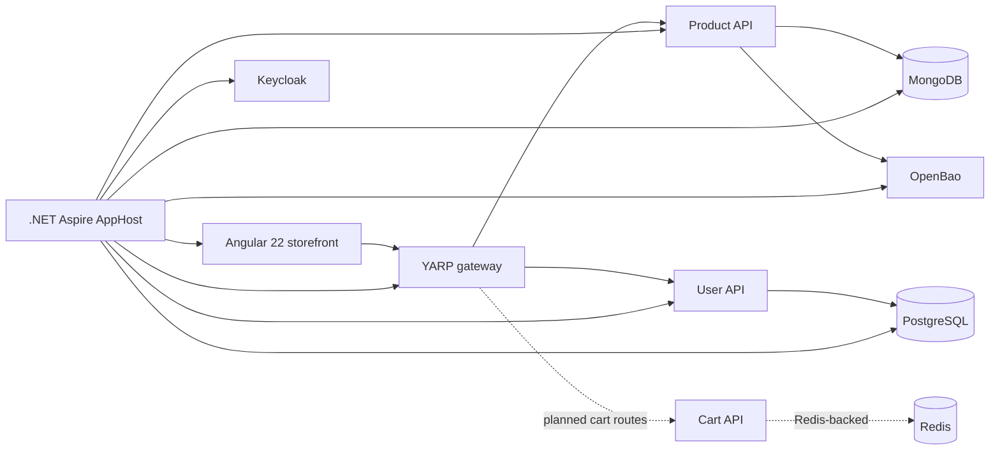

# HardwareNexus

> **🧩 A full-stack platform for discovering and shopping for PC hardware.**

HardwareNexus is a modular hardware-commerce platform for browsing computer components, managing user accounts, and building shopping carts. It brings together an Angular storefront, .NET 10 APIs, a YARP edge gateway, and an Aspire-powered local development environment.

> **🚧 Project status:** active development. The catalog and user-account services are the primary integrated vertical slice. Cart functionality is implemented as a service but is not yet included in the Aspire topology; the Order API is currently a scaffold.

## ✨ What you can do

- **Browse components** — explore CPUs, GPUs, and coolers, with product pages and CPU filters.
- **Manage an account** — register, sign in, verify an account, view a profile, and sign out.
- **Build a cart** — add, view, and remove cart items through the Redis-backed Cart API.
- **Run the platform locally** — launch the integrated development environment from one Aspire AppHost.

## 🏗️ Architecture



The AppHost arranges resources into **Website**, **API**, and **Infrastructure** groups. It starts MongoDB with a seeded hardware catalog, OpenBao with seeded application secrets, PostgreSQL, Keycloak, the Angular development server, the gateway, and the User and Product APIs.

## 🧰 Technology stack

| Area | Technologies |
| --- | --- |
| Storefront | Angular 22, TypeScript, Bootstrap, RxJS, NgRx Signals, MSAL |
| APIs | ASP.NET Core / .NET 10, Controllers, Swagger / OpenAPI |
| Application patterns | Clean Architecture layers, MediatR, FluentValidation, Autofac (Product API) |
| Gateway | YARP reverse proxy with cookie-aware JWT validation |
| Data | MongoDB (catalog), PostgreSQL + EF Core (users), Redis (cart) |
| Local orchestration | .NET Aspire 13, Docker, OpenBao, Keycloak |
| Tests | xUnit, Moq, ASP.NET Core integration-test infrastructure |

## 🛍️ Features

- Product catalog for **CPU**, **GPU**, and **Cooler** categories, including catalog queries, item details, CPU filters, and role-protected catalog mutations.
- User registration, sign-in, current-user lookup, sign-out, account verification, deletion, password hashing, PostgreSQL migrations, and development seeding.
- A reverse-proxy gateway that exposes catalog reads and selected user/cart routes beneath `/gateway`.
- A Redis-backed cart service with add, retrieve, and remove-item operations, configurable cart expiry, and MediatR command/query handlers.
- A responsive Angular UI with category navigation, product views, product filters, authentication screens, and an in-progress cart/checkout interface.
- MongoDB and OpenBao bootstrap scripts, including seeded catalog data and application-secret setup.

## 📁 Repository layout

```text
Aspire/
  Aspire.Host/                 Development orchestrator and infrastructure seed scripts
Services/
  Product/                     MongoDB-backed product catalog API and tests
  User/                        PostgreSQL-backed identity/user API and tests
  Cart/                        Redis-backed cart API and tests
  Order/                       Order API project structure (not implemented yet)
Website/
  Website.Client/              Angular storefront
  Website.Gateway/             YARP edge gateway
HardwareNexus.slnx             Top-level .NET solution
```

## 🚀 Get started

### Before you begin

- [.NET SDK 10](https://dotnet.microsoft.com/download/dotnet/10.0)
- [Node.js](https://nodejs.org/) and npm (the container build uses Node 20)
- Docker Desktop or another Docker-compatible runtime, running locally

The development AppHost starts stateful containers, so Docker must be available before launching it. The host reads local infrastructure settings from `Aspire/Aspire.Host/appsettings.Development.json` and optionally `Aspire/Aspire.Host/Properties/dev.secrets.json`. Do not commit real credentials; use user secrets, environment variables, or the optional local secrets file for replacements.

### Start the full platform

From the repository root:

```bash
npm ci --prefix Website/Website.Client
dotnet restore HardwareNexus.slnx
dotnet run --project Aspire/Aspire.Host
```

Aspire opens its dashboard and shows the assigned endpoints for the storefront, gateway, and APIs. Start there: it is the easiest way to see service health, logs, and URLs. The Angular client uses port `8100` when run by its `start` script; its standalone gateway target is `https://localhost:7100/gateway`.

### Work on the frontend only

```bash
npm --prefix Website/Website.Client start
```

### Create a production frontend bundle

```bash
npm --prefix Website/Website.Client run build
```

## 🔌 API surface

The gateway currently publishes the following routes. The API implementations expose additional controller actions, available through their Swagger UIs when running directly.

| Gateway route | Method | Destination |
| --- | --- | --- |
| `/gateway/product/{type}` | `GET` | list products by category |
| `/gateway/product/{type}/{id}` | `GET` | get a product |
| `/gateway/product/{type}/filters` | `GET` | get filters (currently CPU) |
| `/gateway/user/signin` | `POST` | user sign-in |
| `/gateway/user/me` | `GET` | authenticated current-user profile |
| `/gateway/user/signout` | `POST` | authenticated sign-out |
| `/gateway/cart` | `GET`, `POST` | authenticated cart routes; requires a separately running Cart API |

Product categories are case-sensitive in the current implementation: `CPU`, `GPU`, and `COOLER`.

## 🧪 Build and test

```bash
# Build the complete .NET solution
dotnet build HardwareNexus.slnx

# Run all .NET tests (requires test dependencies described below)
dotnet test HardwareNexus.slnx

# Run one service's tests
dotnet test Services/Cart/tests/CartApi.Application.Test/CartApi.Application.Test.csproj

# Build the Angular application
npm --prefix Website/Website.Client run build
```

### Testing notes

The repository includes unit tests for Cart and User application behavior, controller tests for Cart and User, and unit/integration tests for Product. Product integration tests need an OpenBao configuration and seeded MongoDB; User presentation tests apply migrations and require PostgreSQL on `localhost:5432`. Start the Aspire environment and provide the Product API's `OPENBAO_*` settings before running the full test suite, or run the isolated test projects independently.

At the time this README was prepared, `dotnet build HardwareNexus.slnx` and the Angular production build complete successfully. A full `dotnet test HardwareNexus.slnx` without local infrastructure fails in its Product and User integration tests because OpenBao credentials and PostgreSQL are unavailable; Cart application tests pass. The Cart presentation test project currently has no discoverable tests.

## 🗺️ Current integration boundaries

- Aspire starts the **User API** and **Product API**, but not the **Cart API** or **Order API**.
- The gateway defines cart routes, yet its development cart destination expects a separately deployed `cart-api` service and Redis is not provisioned by the AppHost.
- The gateway currently forwards sign-in, current-user, and sign-out requests; user registration and account verification exist on the User API but are not gateway routes.
- The Order API has project and infrastructure scaffolding but no domain behavior or endpoints.

These boundaries describe the current checked-in state and are useful next milestones for completing the commerce flow.

## 🔐 Security and configuration

The platform uses OpenBao AppRole credentials to retrieve the Product API's MongoDB connection string. The gateway validates bearer tokens and can read an `access_token` cookie; the User API issues that cookie at sign-in. Keep production secrets outside tracked JSON, use TLS, set secure cookie options appropriately, and rotate all development credentials before deploying beyond a local environment.

## 🤝 Contributing

Keep changes scoped to the appropriate service, add or update tests alongside behavior changes, and run the relevant build/test commands before opening a pull request. When adding a service to the integrated experience, update both the Aspire AppHost and the gateway route configuration, then reflect the change here.
